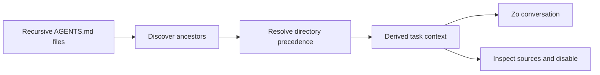
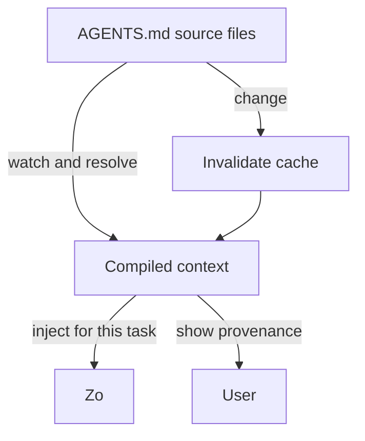
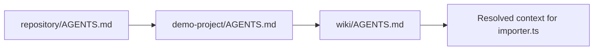

# zocomputer-agents.md

A design proposal and small Deno prototype for deriving scoped, inspectable Zo
context from recursive `AGENTS.md` files.

> **AGENTS.md is the portable source. A derived Zo Rule is the compiled,
> task-scoped output.**

## The proposal in one sentence

Zo should not replace `AGENTS.md` with Zo Rules or ask people to duplicate
instructions: it should discover the `AGENTS.md` hierarchy relevant to a task,
resolve it deterministically, and expose the result as temporary Zo-native
context with clear provenance.

## Why this exists

`AGENTS.md` and Zo Rules solve related but different problems:

|             | `AGENTS.md`                    | Zo Rules                               | Derived context proposed here                         |
| ----------- | ------------------------------ | -------------------------------------- | ----------------------------------------------------- |
| Scope       | Filesystem, project, directory | Zo harness, user, channel, or behavior | Current task and relevant filesystem scope            |
| Portability | Any compatible agent harness   | Zo-specific                            | Generated by Zo, while preserving portable sources    |
| Lifetime    | Until the file changes         | Persisted until edited or removed      | Temporary or cacheable; invalidated by source changes |
| Authority   | Human-maintained source        | Human-maintained Zo behavior           | A transparent projection, never a hidden replacement  |
| Provenance  | File path and line             | Rule metadata                          | Every statement links back to source files and lines  |

The prototype focuses on the narrowest useful behavior: **recursive discovery
plus deterministic merging**. It does not pretend that every paragraph can
safely become a native rule.

## Mental model



The derived result is analogous to compiled output:



## Example

Suppose the task touches `examples/demo-project/wiki/importer.ts`:

```text
repository/
├── AGENTS.md
└── examples/demo-project/
    ├── AGENTS.md
    └── wiki/
        ├── AGENTS.md
        └── importer.ts   ← task target
```

The resolver loads the applicable files from broadest to narrowest scope:



The user-facing result could look like this:

```text
ACTIVE PROJECT CONTEXT

Scope: examples/demo-project/wiki/**
Status: derived for this task

✓ Read README.md before editing
✓ Use wiki query for knowledge-base searches
✓ Run deno test after changes
✓ Keep private data local

Sources:
  AGENTS.md (repository scope, lines 1–4)
  examples/demo-project/AGENTS.md (project scope, lines 1–6)
  examples/demo-project/wiki/AGENTS.md (wiki scope, lines 1–5)

[Inspect sources] [Disable for this task] [Promote to Zo Rule]
```

The important word is **derived**, not hidden. If Zo applies instructions that
the user cannot inspect, the feature becomes difficult to trust and debug.

## What belongs where?

A useful boundary is:

- Put portable project knowledge, file-layout conventions, build commands, and
  directory-specific constraints in `AGENTS.md`.
- Put Zo-specific personal behavior, channel behavior, and cross-project
  preferences in Zo Rules.
- Let derived context bridge the two without making either file pretend to be
  the other.

This is not a proposal to convert all Markdown into permanent Zo Rules. It is a
proposal to make the applicable project instructions available to Zo without
fragile routing prompts or manual duplication.

## Resolution algorithm

Given a task target path `T`:

1. Start at the repository or workspace root and walk toward `T`.
2. At each directory, look for `AGENTS.md`.
3. Load applicable files in ancestor-to-descendant order.
4. Preserve source path, scope, line range, and content for provenance.
5. Emit an ordered derived context.
6. Apply explicit precedence: more-specific instructions may refine or override
   broader instructions, while conflicts should be surfaced rather than silently
   discarded.
7. Cache the result by target path plus source modification metadata.
8. Invalidate or recompute when an applicable file changes.

The prototype intentionally does **not** use an LLM to decide which files apply.
Directory scope is deterministic. Natural-language interpretation can be a later
layer, with confidence and approval controls.


## Trust and safety requirements

A production implementation should provide:

1. **Visibility:** show when derived context is active.
2. **Provenance:** link every derived item to a source path and line range.
3. **Scope:** bind context to the task's actual files, not the entire account by
   default.
4. **Precedence:** make broad-to-specific ordering explicit.
5. **Conflict reporting:** surface contradictions instead of silently choosing.
6. **Reversibility:** allow disabling derived context for one task or
   conversation.
7. **No silent promotion:** never turn a project instruction into a persistent
   global Zo Rule without approval.
8. **Prompt-injection resistance:** treat repository instructions as untrusted
   project input; enforce platform and user-level safety boundaries first.
9. **Change awareness:** watch or re-check source modification metadata before
   using cached context.
10. **Portable fallback:** if no resolver exists, compatible agents can still
    read the original Markdown files.

## Prototype

The Deno script at [`src/derive.ts`](./src/derive.ts) discovers recursive
`AGENTS.md` files for a target path and emits JSON containing:

- the target path and scope;
- applicable source files in precedence order;
- each source's relative path, directory scope, and line-numbered content;
- a simple assembled context preview;
- deterministic diagnostics for missing targets and conflicting `AGENTS.md`
  locations.

It is deliberately a transparent resolver, not an AI parser or a Zo integration.
That makes the core behavior easy to test and discuss.

### Run it

Requires Deno 2.x.

```sh
deno run --allow-read src/derive.ts examples/demo-project/wiki/importer.ts
```

Write JSON to a file:

```sh
deno run --allow-read src/derive.ts examples/demo-project/wiki/importer.ts > derived-context.json
```

Run tests:

```sh
deno test
```

## Example output

```json
{
  "target": "examples/demo-project/wiki/importer.ts",
  "sources": [
    {
      "path": "AGENTS.md",
      "scope": "."
    },
    {
      "path": "examples/demo-project/AGENTS.md",
      "scope": "examples/demo-project"
    },
    {
      "path": "examples/demo-project/wiki/AGENTS.md",
      "scope": "examples/demo-project/wiki"
    }
  ],
  "diagnostics": [],
  "context": "... broad-to-narrow instructions ..."
}
```

## Non-goals for the first version

- Converting every sentence into a persistent Zo Rule.
- Replacing Zo's existing Rules UI.
- Inventing a universal syntax for natural-language instructions.
- Treating a repository file as higher authority than user, platform, or safety
  constraints.
- Solving every cross-repository or symlink policy question.
- Claiming that derived context guarantees model compliance.

## Open design questions

- Should scope be based on the edited file, the repository, the whole task, or
  all three with separate labels?
- Should users opt in per workspace, with a global default off?
- How should `AGENTS.md` imports, symlinks, generated files, and monorepo
  boundaries work?
- Should conflicts block an action, ask the user, or merely appear as
  diagnostics?
- Which instructions are safe to summarize, and which must remain verbatim?
- Should Zo expose a compiled context artifact for other agent harnesses?

## Suggested product language

> **Derived project context** is the scoped set of instructions Zo found in the
> `AGENTS.md` files that govern the files relevant to your task. It is shown
> with its sources, used temporarily, and recomputed when those sources change.

Short version:

> **Don't replace `AGENTS.md` with Zo Rules. Compile the relevant `AGENTS.md`
> hierarchy into temporary Zo context.**

## Evaluation

The skill at
[`skills/zocomputer-agents.md-evals/`](./skills/zocomputer-agents.md-evals/)
runs a treatment-vs-control experiment to measure whether derived Zo Rules
surface `AGENTS.md` instructions without requiring manual file discovery.

### Experiment design

| Group     | Zo Rules                         | AGENTS.md files | What's measured                                      |
| --------- | -------------------------------- | --------------- | ---------------------------------------------------- |
| Treatment | Derived from AGENTS.md hierarchy | On disk         | Agent should know instructions without reading files |
| Control   | None                             | On disk         | Agent must manually discover instructions            |

### Methodology

1. Clone repo to Zo, verify Deno available.
2. Run `src/derive.ts` for each test target; parse JSON to get sources and
   scopes.
3. Create Zo Rules via `zo_create_rule` — condition uses the derived scope
   (`"When working on files in <scope>"`), instruction is the AGENTS.md content.
4. **Treatment**: agent answers read-only prompt with rules active; no AGENTS.md
   file reads permitted.
5. Delete all rules via `zo_delete_rule`.
6. **Control**: same prompts, no rules; agent must discover AGENTS.md files
   manually.
7. Grade both passes: check instruction recall per assertion and detect
   AGENTS.md file reads.

### Results (iteration 1)

| Metric          | Treatment | Control        | Delta      |
| --------------- | --------- | -------------- | ---------- |
| Pass rate       | 100%      | 80.2%          | **+19.8%** |
| Avg time        | 14.6s     | 20.8s          | **-6.3s**  |
| Avg tokens      | 3,233     | 4,733          | **-1,500** |
| AGENTS.md reads | 0         | 1–3 per target | —          |

Three test cases cover 1-level (root only), 2-level (root → project), and
3-level (root → project → wiki) AGENTS.md hierarchies.

### Results (iteration 2) — independent subagents

| Metric          | Treatment | Control | Delta  |
| --------------- | --------- | ------- | ------ |
| Pass rate       | 60.3%     | 71.9%   | -11.6% |
| Avg time        | 18.8s     | 24.5s   | -5.7s  |
| Avg tokens      | 4,400     | 6,900   | -2,500 |
| AGENTS.md reads | 0         | 2–4     | —      |

Four test cases including a new **scoping isolation** eval that verifies sibling
`AGENTS.md` files do not leak into ancestor-derived context.

#### Key findings (iteration 2)

- **Zo Rules do not reach subagents**: treatment subagents were forbidden from
  reading `AGENTS.md` files and had no rule-injected context → 14.3% for the
  3-level eval.
- **Scoping error detected**: eval 2 control read `wiki/AGENTS.md` for a target
  at `demo-project/` level. `wiki/` is a sibling, not an ancestor. The derive
  resolver correctly excludes it.
- **Sibling isolation confirmed** (eval 4): both treatment and control correctly
  identified that `other/AGENTS.md` instructions do not apply to a `wiki/`
  target. The derive resolver walks only ancestor directories.

### Limitations

- Iteration 1: same agent authored both passes; iteration 2 used independent
  subagents.
- Zo Rules created on the remote server do not propagate to locally-spawned
  subagents — a pre-requisite for full end-to-end testing.
- Read-only prompts were used; edit-oriented prompts would exercise post-change
  instructions more realistically.

## Repository layout

```text
.
├── README.md
├── deno.json
├── examples/
│   └── demo-project/
│       ├── AGENTS.md
│       ├── other/
│       │   └── AGENTS.md
│       └── wiki/
│           ├── AGENTS.md
│           └── importer.ts
├── skills/
│   └── zocomputer-agents.md-evals/
│       ├── SKILL.md
│       ├── evals/
│       │   └── evals.json
│       ├── scripts/
│       │   └── grade.ts
│       └── references/
│           └── expectations.md
├── src/
│   └── derive.ts
└── tests/
    └── derive_test.ts
```

## License

MIT
