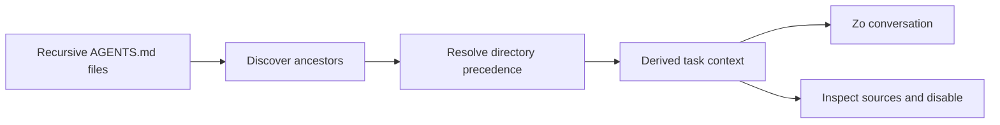
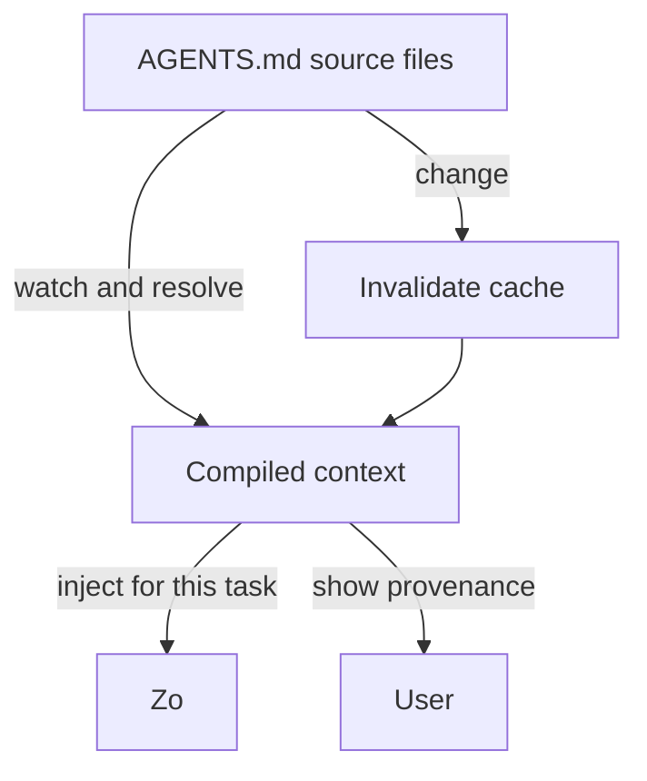
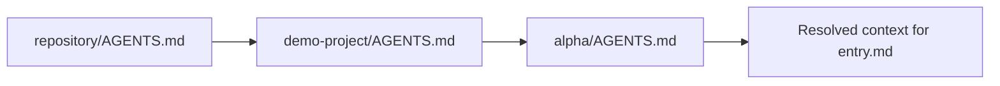
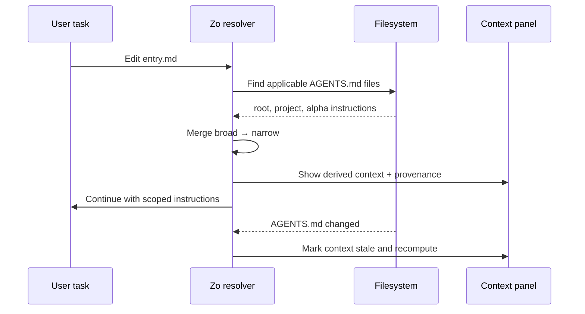

# zocomputer-agents.md

A design proposal and small Deno prototype for deriving scoped, inspectable Zo
context from recursive `AGENTS.md` files.

> **AGENTS.md is the portable source. A derived Zo Rule is the compiled,
> task-scoped output.**

## The proposal in one sentence

Zo should not replace `AGENTS.md` with Zo Rules or ask people to duplicate
instructions: it should discover the `AGENTS.md` hierarchy relevant to a task,
resolve it deterministically, and expose the result as temporary Zo-native
context with clear provenance.

## Why this exists

`AGENTS.md` and Zo Rules solve related but different problems:

|             | `AGENTS.md`                    | Zo Rules                               | Derived context proposed here                         |
| ----------- | ------------------------------ | -------------------------------------- | ----------------------------------------------------- |
| Scope       | Filesystem, project, directory | Zo harness, user, channel, or behavior | Current task and relevant filesystem scope            |
| Portability | Any compatible agent harness   | Zo-specific                            | Generated by Zo, while preserving portable sources    |
| Lifetime    | Until the file changes         | Persisted until edited or removed      | Temporary or cacheable; invalidated by source changes |
| Authority   | Human-maintained source        | Human-maintained Zo behavior           | A transparent projection, never a hidden replacement  |
| Provenance  | File path and line             | Rule metadata                          | Every statement links back to source files and lines  |

The prototype focuses on the narrowest useful behavior: **recursive discovery
plus deterministic merging**. It does not pretend that every paragraph can
safely become a native rule.

## Mental model



The derived result is analogous to compiled output:



## Example

Suppose the task touches `examples/demo-project/alpha/entry.md`:

```text
repository/
├── AGENTS.md
└── examples/demo-project/
    ├── AGENTS.md
    └── alpha/
        ├── AGENTS.md
        └── entry.md   ← task target
```

The resolver loads the applicable files from broadest to narrowest scope:



The user-facing result could look like this:

```text
ACTIVE PROJECT CONTEXT

Scope: examples/demo-project/alpha/**
Source: AGENTS.md hierarchy (3 files)
Updated: when sources change

✓ Be concise. Avoid redundant phrasing.   ← AGENTS.md:3
✓ Prefer small, reversible changes        ← examples/demo-project/AGENTS.md:4
✓ Use past tense in all output            ← examples/demo-project/alpha/AGENTS.md:1

[Inspect sources] [Disable for this repo]
```

The important word is **derived**, not hidden. If Zo applies instructions that
the user cannot inspect, the feature becomes difficult to trust and debug.

## What belongs where?

A useful boundary is:

- Put portable project knowledge, file-layout conventions, build commands, and
  directory-specific constraints in the project instruction file Zo supports for
  that repo, whether that's `AGENTS.md`, `CLAUDE.md`, `GEMINI.md`,
  `.cursorrules`, or another convention the harness recognizes.
- Put Zo-specific personal behavior, channel behavior, and cross-project
  preferences in Zo Rules.
- Let derived context bridge the two without making either file pretend to be
  the other.

This is not a proposal to convert all Markdown into permanent Zo Rules. It is a
proposal to make the applicable project instructions available to Zo without
fragile routing prompts or manual duplication.

## Resolution algorithm

Given a task target path `T`:

1. Start at the repository or workspace root and walk toward `T`.
2. At each directory, look for `AGENTS.md`.
3. Load applicable files in ancestor-to-descendant order.
4. Preserve source path, scope, line range, and content for provenance.
5. Emit an ordered derived context.
6. Apply explicit precedence: more-specific instructions may refine or override
   broader instructions, while conflicts should be surfaced rather than silently
   discarded.
7. Cache the result by target path plus source modification metadata.
8. Invalidate or recompute when an applicable file changes.

The prototype intentionally does **not** use an LLM to decide which files apply.
Directory scope is deterministic. Natural-language interpretation can be a later
layer, with confidence and approval controls.



## Trust and safety requirements

A production implementation should provide:

1. **Visibility:** show when derived context is active.
2. **Provenance:** link every derived item to a source path and line range.
3. **Scope:** bind context to the task's actual files, not the entire account by
   default.
4. **Precedence:** make broad-to-specific ordering explicit.
5. **Conflict reporting:** surface contradictions instead of silently choosing.
6. **Reversibility:** allow disabling derived context for one task or
   conversation.
7. **No silent promotion:** never turn a project instruction into a persistent
   global Zo Rule without approval.
8. **Prompt-injection resistance:** treat repository instructions as untrusted
   project input; enforce platform and user-level safety boundaries first.
9. **Change awareness:** watch or re-check source modification metadata before
   using cached context.
10. **Portable fallback:** if no resolver exists, compatible agents can still
    read the original Markdown files.

## Prototype

The Deno script at [`src/derive.ts`](./src/derive.ts) discovers recursive
`AGENTS.md` files for a target path and emits JSON containing:

- the target path and scope;
- applicable source files in precedence order;
- each source's relative path, directory scope, and line-numbered content;
- a simple assembled context preview;
- deterministic diagnostics for missing targets and conflicting `AGENTS.md`
  locations.

It is deliberately a transparent resolver, not an AI parser or a Zo integration.
That makes the core behavior easy to test and discuss.

### Run it

Requires Deno 2.x.

```sh
deno run --allow-read src/derive.ts examples/demo-project/red/rose.md
```

Write JSON to a file:

```sh
deno run --allow-read src/derive.ts examples/demo-project/red/rose.md > derived-context.json
```

Run tests:

```sh
deno test
```

## Example output

```json
{
  "target": "examples/demo-project/alpha/entry.md",
  "sources": [
    {
      "path": "AGENTS.md",
      "scope": "."
    },
    {
      "path": "examples/demo-project/AGENTS.md",
      "scope": "examples/demo-project"
    },
    {
      "path": "examples/demo-project/alpha/AGENTS.md",
      "scope": "examples/demo-project/alpha"
    }
  ],
  "diagnostics": [],
  "context": "... broad-to-narrow instructions ..."
}
```

## Non-goals for the first version

- Converting every sentence into a persistent Zo Rule.
- Replacing Zo's existing Rules UI.
- Inventing a universal syntax for natural-language instructions.
- Treating a repository file as higher authority than user, platform, or safety
  constraints.
- Solving every cross-repository or symlink policy question.
- Claiming that derived context guarantees model compliance.

## Open design questions

- Should scope be based on the edited file, the repository, the whole task, or
  all three with separate labels?
- Should users opt in per workspace, with a global default off?
- How should `AGENTS.md` imports, symlinks, generated files, and monorepo
  boundaries work?
- Should conflicts block an action, ask the user, or merely appear as
  diagnostics?
- Which instructions are safe to summarize, and which must remain verbatim?
- Should Zo expose a compiled context artifact for other agent harnesses?

## Suggested product language

> **Derived project context** is the scoped set of instructions Zo found in the
> `AGENTS.md` files that govern the files relevant to your task. It is shown
> with its sources, used temporarily, and recomputed when those sources change.

Short version:

> **Don't replace `AGENTS.md` with Zo Rules. Compile the relevant `AGENTS.md`
> hierarchy into temporary Zo context.**

## Evaluation

### Expected implications

Tokens saved: Without derived rules, Zo discovers instructions by reading
AGENTS.md files via tool calls. Each read costs tokens for the file content plus
tool-call framing. With derived rules, instructions are injected directly as
context, zero discovery tokens.

Latency saved: Each tool call to read a file adds a round-trip (~53-129s on the
Zo free tier). Derived rules eliminate 2-3 file reads per conversation, shaving
minutes off tasks that touch multiple directories.

Reliability: File discovery depends on the model correctly identifying which
files to read and in what order. Derived rules are deterministic. The resolver
guarantees broad-to-narrow precedence without relying on the model to discover
the hierarchy.

### Anecdotal testing

We ran four iterations of treatment-vs-control experiments via the Zo Ask API to
validate the pipeline end-to-end:

1. Derived rules reach the Zo API and affect output; treatment responses
   followed injected instructions (e.g., past-tense alpha, future-tense beta).
2. Without rules, Zo can still read AGENTS.md files from disk and usually
   complies. The compliance delta was small because file discovery works when
   the model finds the right files.
3. The real value is reliable, fast context injection, not whether the model
   eventually figures out the instructions, but whether it has them immediately
   without spending tokens and latency on discovery.

The pipeline works. The next step is production integration, not more
benchmarks.

## License

MIT
